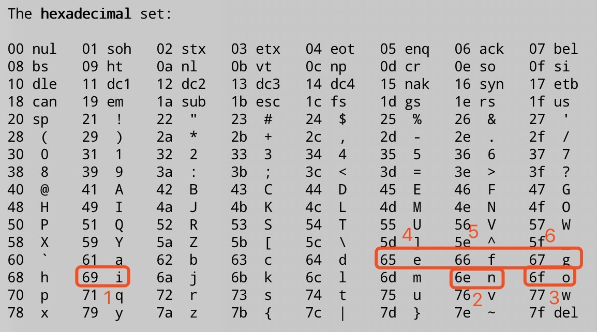

# Bomb Lab

## Source

```
    72	    /* Hmm...  Six phases must be more secure than one phase! */
    73	    input = read_line();             /* Get input                   */
    74	    phase_1(input);                  /* Run the phase               */
    75	    phase_defused();                 /* Drat!  They figured it out!
    76					      * Let me know how they did it. */
    77	    printf("Phase 1 defused. How about the next one?\n");
    78
    79	    /* The second phase is harder.  No one will ever figure out
    80	     * how to defuse this... */
    81	    input = read_line();
    82	    phase_2(input);
    83	    phase_defused();
    84	    printf("That's number 2.  Keep going!\n");
    85
    86	    /* I guess this is too easy so far.  Some more complex code will
    87	     * confuse people. */
    88	    input = read_line();
    89	    phase_3(input);
    90	    phase_defused();
    91	    printf("Halfway there!\n");
    92
    93	    /* Oh yeah?  Well, how good is your math?  Try on this saucy problem! */
    94	    input = read_line();
    95	    phase_4(input);
    96	    phase_defused();
    97	    printf("So you got that one.  Try this one.\n");
    98
    99	    /* Round and 'round in memory we go, where we stop, the bomb blows! */
   100	    input = read_line();
   101	    phase_5(input);
   102	    phase_defused();
   103	    printf("Good work!  On to the next...\n");
   104
   105	    /* This phase will never be used, since no one will get past the
   106	     * earlier ones.  But just in case, make this one extra hard. */
   107	    input = read_line();
   108	    phase_6(input);
   109	    phase_defused();

```

# break points

```
# gdb bomb
GNU gdb (GDB) Red Hat Enterprise Linux 7.6.1-100.el7_4.1
Copyright (C) 2013 Free Software Foundation, Inc.
License GPLv3+: GNU GPL version 3 or later <http://gnu.org/licenses/gpl.html>
This is free software: you are free to change and redistribute it.
There is NO WARRANTY, to the extent permitted by law.  Type "show copying"
and "show warranty" for details.
This GDB was configured as "x86_64-redhat-linux-gnu".
For bug reporting instructions, please see:
<http://www.gnu.org/software/gdb/bugs/>...
Reading symbols from /root/workspace/bomb/bomb...done.
(gdb) b 73
Breakpoint 1 at 0x400e37: file bomb.c, line 73.
(gdb) b 81
Breakpoint 2 at 0x400e53: file bomb.c, line 81.
(gdb) b 88
Breakpoint 3 at 0x400e6f: file bomb.c, line 88.
(gdb) b 94
Breakpoint 4 at 0x400e8b: file bomb.c, line 94.
(gdb) b 100
Breakpoint 5 at 0x400ea7: file bomb.c, line 100.
(gdb) b 107
Breakpoint 6 at 0x400ec3: file bomb.c, line 107.
(gdb)
```

## Phase 1

```
(gdb) l 73
68
69	    printf("Welcome to my fiendish little bomb. You have 6 phases with\n");
70	    printf("which to blow yourself up. Have a nice day!\n");
71
72	    /* Hmm...  Six phases must be more secure than one phase! */
73	    input = read_line();             /* Get input                   */
74	    phase_1(input);                  /* Run the phase               */
75	    phase_defused();                 /* Drat!  They figured it out!
76					      * Let me know how they did it. */
77	    printf("Phase 1 defused. How about the next one?\n");
(gdb) disassemble phase_1
Dump of assembler code for function phase_1:
   0x0000000000400ee0 <+0>:	sub    $0x8,%rsp
   0x0000000000400ee4 <+4>:	mov    $0x402400,%esi                   # char *s ="Border relations with Canada have never been better." 
   0x0000000000400ee9 <+9>:	callq  0x401338 <strings_not_equal>     # n = strings_not_equal (input, s)
   0x0000000000400eee <+14>:	test   %eax,%eax                    # if n == 0: goto .RETURN
   0x0000000000400ef0 <+16>:	je     0x400ef7 <phase_1+23>        #
   0x0000000000400ef2 <+18>:	callq  0x40143a <explode_bomb>      # else: explode

   .RETURN
   0x0000000000400ef7 <+23>:	add    $0x8,%rsp
   0x0000000000400efb <+27>:	retq
End of assembler dump.
(gdb) p /s (char *)0x402400
$1 = 0x402400 "Border relations with Canada have never been better."
```

```
(gdb) r
Starting program: /root/workspace/bomb/bomb
Welcome to my fiendish little bomb. You have 6 phases with
which to blow yourself up. Have a nice day!

Breakpoint 1, main (argc=<optimized out>, argv=<optimized out>) at bomb.c:73
73	    input = read_line();             /* Get input                   */
Missing separate debuginfos, use: debuginfo-install glibc-2.17-260.el7_6.5.x86_64
(gdb) c
Continuing.
Border relations with Canada have never been better.                   <=========== Input here
Phase 1 defused. How about the next one?

Breakpoint 2, main (argc=<optimized out>, argv=<optimized out>) at bomb.c:81
81	    input = read_line();
(gdb)
```

## Phase 2

```
(gdb) l 81
76					      * Let me know how they did it. */
77	    printf("Phase 1 defused. How about the next one?\n");
78
79	    /* The second phase is harder.  No one will ever figure out
80	     * how to defuse this... */
81	    input = read_line();
82	    phase_2(input);
83	    phase_defused();
84	    printf("That's number 2.  Keep going!\n");
85
(gdb) disassemble phase_2
Dump of assembler code for function phase_2:
   0x0000000000400efc <+0>:	push   %rbp
   0x0000000000400efd <+1>:	push   %rbx
   0x0000000000400efe <+2>:	sub    $0x28,%rsp
   0x0000000000400f02 <+6>:	mov    %rsp,%rsi                    # it's array y in read_six_numbers
   0x0000000000400f05 <+9>:	callq  0x40145c <read_six_numbers>  # no return value, %eax not used 
   0x0000000000400f0a <+14>:	cmpl   $0x1,(%rsp)              # if y[0] == 1: goto  L1
   0x0000000000400f0e <+18>:	je     0x400f30 <phase_2+52>
   0x0000000000400f10 <+20>:	callq  0x40143a <explode_bomb>
   0x0000000000400f15 <+25>:	jmp    0x400f30 <phase_2+52>    # ????

   .L2
   0x0000000000400f17 <+27>:	mov    -0x4(%rbx),%eax          # int t = *(p - 1)  // y[0] for first loop, y[1] the second...
   0x0000000000400f1a <+30>:	add    %eax,%eax                # t *= 2
   0x0000000000400f1c <+32>:	cmp    %eax,(%rbx)              # if (*p == t) : goto L3
   0x0000000000400f1e <+34>:	je     0x400f25 <phase_2+41>
   0x0000000000400f20 <+36>:	callq  0x40143a <explode_bomb>

   .L3
   0x0000000000400f25 <+41>:	add    $0x4,%rbx                # p += 1
   0x0000000000400f29 <+45>:	cmp    %rbp,%rbx                # if p != end: goto .L2
   0x0000000000400f2c <+48>:	jne    0x400f17 <phase_2+27>
   0x0000000000400f2e <+50>:	jmp    0x400f3c <phase_2+64>

   .L1
   0x0000000000400f30 <+52>:	lea    0x4(%rsp),%rbx          # int *p = &y[1]
   0x0000000000400f35 <+57>:	lea    0x18(%rsp),%rbp         $ int *end = &y[6]
   0x0000000000400f3a <+62>:	jmp    0x400f17 <phase_2+27>
   0x0000000000400f3c <+64>:	add    $0x28,%rsp
   0x0000000000400f40 <+68>:	pop    %rbx
   0x0000000000400f41 <+69>:	pop    %rbp
   0x0000000000400f42 <+70>:	retq
End of assembler dump.
(gdb) disassemble read_six_numbers
Dump of assembler code for function read_six_numbers:   # input: %rdi   y: %rsi
   0x000000000040145c <+0>:	sub    $0x18,%rsp
   0x0000000000401460 <+4>:	mov    %rsi,%rdx                        # t0 = &y[0]  // %rdx
   0x0000000000401463 <+7>:	lea    0x4(%rsi),%rcx                   # t1 = &y[1]  // %rcx
   0x0000000000401467 <+11>:	lea    0x14(%rsi),%rax              # t2 = &y[5]  // %rax
   0x000000000040146b <+15>:	mov    %rax,0x8(%rsp)               # t3 = t2 = &y[5]   // 0x8(%rsp)
   0x0000000000401470 <+20>:	lea    0x10(%rsi),%rax              # t2 = &y[4]  // %rax
   0x0000000000401474 <+24>:	mov    %rax,(%rsp)                  # t4 = t2 = &y[4]    // (%rsp)
   0x0000000000401478 <+28>:	lea    0xc(%rsi),%r9                # t5 = &y[3]  // %r9
   0x000000000040147c <+32>:	lea    0x8(%rsi),%r8                # t6 = &y[2]  // %r8
   0x0000000000401480 <+36>:	mov    $0x4025c3,%esi               # char fmt[] = "%d %d %d %d %d %d"  // %esi
   0x0000000000401485 <+41>:	mov    $0x0,%eax                    # n = 0         // %eax
   0x000000000040148a <+46>:	callq  0x400bf0 <__isoc99_sscanf@plt>  # n = sscanf(input, fmt, &y[0], &y[1], &y[2], &y[3], &y[4], &y[5])
   0x000000000040148f <+51>:	cmp    $0x5,%eax
   0x0000000000401492 <+54>:	jg     0x401499 <read_six_numbers+61>
   0x0000000000401494 <+56>:	callq  0x40143a <explode_bomb>
   0x0000000000401499 <+61>:	add    $0x18,%rsp
   0x000000000040149d <+65>:	retq
End of assembler dump.
(gdb) p /s (char *)0x4025c3
$1 = 0x4025c3 "%d %d %d %d %d %d"                                  # so, sscanf (input, "%d %d %d %d %d %d", int_ptrs...)
```


```
Continuing.
1 2 4 8 16 32
That's number 2.  Keep going!
```

## Phase 3

```
(gdb) disas phase_3
Dump of assembler code for function phase_3:                        # phase_3 (char[] input)
   0x0000000000400f43 <+0>:	sub    $0x18,%rsp                           
   0x0000000000400f47 <+4>:	lea    0xc(%rsp),%rcx                       # unsigned int y             // 0xc(%rsp)
   0x0000000000400f4c <+9>:	lea    0x8(%rsp),%rdx                       # unsigned int x             // 0x8(%rsp)
   0x0000000000400f51 <+14>:	mov    $0x4025cf,%esi                   # char fmt[] = "%d %d"
   0x0000000000400f56 <+19>:	mov    $0x0,%eax                        # int n = 0
   0x0000000000400f5b <+24>:	callq  0x400bf0 <__isoc99_sscanf@plt>   # n = sscanf (input, fmt, &x, &y)
   0x0000000000400f60 <+29>:	cmp    $0x1,%eax                        # if n > 1: goto .L1
   0x0000000000400f63 <+32>:	jg     0x400f6a <phase_3+39>
   0x0000000000400f65 <+34>:	callq  0x40143a <explode_bomb>

   .L1
   0x0000000000400f6a <+39>:	cmpl   $0x7,0x8(%rsp)                   # if y > 0x7: goto .L2 (explode_bomb), so 0 - 7 in switch
   0x0000000000400f6f <+44>:	ja     0x400fad <phase_3+106>
   0x0000000000400f71 <+46>:	mov    0x8(%rsp),%eax                   # switch (x)
   0x0000000000400f75 <+50>:	jmpq   *0x402470(,%rax,8)               
   0x0000000000400f7c <+57>:	mov    $0xcf,%eax                       # case 0: t = 0xcf
   0x0000000000400f81 <+62>:	jmp    0x400fbe <phase_3+123>
   0x0000000000400f83 <+64>:	mov    $0x2c3,%eax                      # case 2: t = 0x2c3
   0x0000000000400f88 <+69>:	jmp    0x400fbe <phase_3+123>
   0x0000000000400f8a <+71>:	mov    $0x100,%eax                      # case 3: t = 0x100
   0x0000000000400f8f <+76>:	jmp    0x400fbe <phase_3+123>
   0x0000000000400f91 <+78>:	mov    $0x185,%eax                      # case 4: t = 0x185
   0x0000000000400f96 <+83>:	jmp    0x400fbe <phase_3+123>
   0x0000000000400f98 <+85>:	mov    $0xce,%eax                       # case 5: t = 0xce
   0x0000000000400f9d <+90>:	jmp    0x400fbe <phase_3+123>
   0x0000000000400f9f <+92>:	mov    $0x2aa,%eax                      # case 6: t = 0x2aa
   0x0000000000400fa4 <+97>:	jmp    0x400fbe <phase_3+123>
   0x0000000000400fa6 <+99>:	mov    $0x147,%eax                      # case 7: t = 0x147
   0x0000000000400fab <+104>:	jmp    0x400fbe <phase_3+123>

   .L2
   0x0000000000400fad <+106>:	callq  0x40143a <explode_bomb>
   0x0000000000400fb2 <+111>:	mov    $0x0,%eax
   0x0000000000400fb7 <+116>:	jmp    0x400fbe <phase_3+123>

   .default
   0x0000000000400fb9 <+118>:	mov    $0x137,%eax                      # default: t = 0x137

   .L3
   0x0000000000400fbe <+123>:	cmp    0xc(%rsp),%eax                   # if y == t: goto .RETURN
   0x0000000000400fc2 <+127>:	je     0x400fc9 <phase_3+134>
   0x0000000000400fc4 <+129>:	callq  0x40143a <explode_bomb>

   .RETURN
   0x0000000000400fc9 <+134>:	add    $0x18,%rsp
   0x0000000000400fcd <+138>:	retq
End of assembler dump.
(gdb) x/8gx 0x402470
0x402470:	0x0000000000400f7c	0x0000000000400fb9  // case 0, 1(default)
0x402480:	0x0000000000400f83	0x0000000000400f8a  // case 2, 3
0x402490:	0x0000000000400f91	0x0000000000400f98  // case 4, 5
0x4024a0:	0x0000000000400f9f	0x0000000000400fa6  // case 6, 7
```

| label | value |
| ----- | ----- |
| 0     | 207   |
| 1     | 311   |
| 2     | 707   |
| 3     | 256   |
| 4     | 389   |
| 5     | 206   |
| 6     | 682   |
| 7     | 326   |

```
(gdb) c
Continuing.
0 207
Halfway there!
```

## Phase 4

```
(gdb) disas phase_4
Dump of assembler code for function phase_4:
   0x000000000040100c <+0>:	sub    $0x18,%rsp
   0x0000000000401010 <+4>:	lea    0xc(%rsp),%rcx                       # unsigned int y
   0x0000000000401015 <+9>:	lea    0x8(%rsp),%rdx                       # unsigned int x
   0x000000000040101a <+14>:	mov    $0x4025cf,%esi                   # char[] fmt = "%d %d"
   0x000000000040101f <+19>:	mov    $0x0,%eax                        # int n = 0
   0x0000000000401024 <+24>:	callq  0x400bf0 <__isoc99_sscanf@plt>   # n = sscanf (input, fmt, &x, &y)
   0x0000000000401029 <+29>:	cmp    $0x2,%eax                        # if n != 2: goto .L1 (explode)
   0x000000000040102c <+32>:	jne    0x401035 <phase_4+41>
   0x000000000040102e <+34>:	cmpl   $0xe,0x8(%rsp)                   # if y <= 14: goto .L2
   0x0000000000401033 <+39>:	jbe    0x40103a <phase_4+46>            
   .L1
   0x0000000000401035 <+41>:	callq  0x40143a <explode_bomb>

   .L2
   0x000000000040103a <+46>:	mov    $0xe,%edx                        # unsigned int c = 14
   0x000000000040103f <+51>:	mov    $0x0,%esi                        # unsigned int b = 0
   0x0000000000401044 <+56>:	mov    0x8(%rsp),%edi                   # unsigned int a = x
   0x0000000000401048 <+60>:	callq  0x400fce <func4>                 # n = func (a, b, c)  // func (x, 0, 14)
   0x000000000040104d <+65>:	test   %eax,%eax                        # if n != 0: goto .L3 (explode)
   0x000000000040104f <+67>:	jne    0x401058 <phase_4+76>
   0x0000000000401051 <+69>:	cmpl   $0x0,0xc(%rsp)                   # if y == 0: goto .L4 (return)
   0x0000000000401056 <+74>:	je     0x40105d <phase_4+81>

   .L3
   0x0000000000401058 <+76>:	callq  0x40143a <explode_bomb>

   .L4
   0x000000000040105d <+81>:	add    $0x18,%rsp
   0x0000000000401061 <+85>:	retq
End of assembler dump.
(gdb) x/s 0x4025cf
0x4025cf:	"%d %d"
```

```
(gdb) disas func4
Dump of assembler code for function func4:                  # func4 (a: %edi, b: %esi, c: %edx)
   0x0000000000400fce <+0>:	sub    $0x8,%rsp
   0x0000000000400fd2 <+4>:	mov    %edx,%eax                # unsigned int t1 = c        # %eax
   0x0000000000400fd4 <+6>:	sub    %esi,%eax                # t1 -= b
   0x0000000000400fd6 <+8>:	mov    %eax,%ecx                #    so far: t1 = c - b  
   0x0000000000400fd8 <+10>:	shr    $0x1f,%ecx           # unsigned int t2 = t1 >> 31 # %ecx
   0x0000000000400fdb <+13>:	add    %ecx,%eax            # t1 += t2
   0x0000000000400fdd <+15>:	sar    %eax                 # t1 >>= 1
   0x0000000000400fdf <+17>:	lea    (%rax,%rsi,1),%ecx   # ugsigned int t3 = t1 + b  # %ecx

   0x0000000000400fe2 <+20>:	cmp    %edi,%ecx            # if t3 <= a: goto .L1
   0x0000000000400fe4 <+22>:	jle    0x400ff2 <func4+36>
   0x0000000000400fe6 <+24>:	lea    -0x1(%rcx),%edx      # unsigned int t4 = t3 - 1 
   0x0000000000400fe9 <+27>:	callq  0x400fce <func4>     # n = func4 (a, )
   0x0000000000400fee <+32>:	add    %eax,%eax            # n *= 2
   0x0000000000400ff0 <+34>:	jmp    0x401007 <func4+57>  # goto .L2 (Return)

   .L1
   0x0000000000400ff2 <+36>:	mov    $0x0,%eax            # int n = 0
   0x0000000000400ff7 <+41>:	cmp    %edi,%ecx            # if t3 >= a: goto .L2 (Return)
   0x0000000000400ff9 <+43>:	jge    0x401007 <func4+57>
   0x0000000000400ffb <+45>:	lea    0x1(%rcx),%esi       # b = t3 + 1
   0x0000000000400ffe <+48>:	callq  0x400fce <func4>       # n = func4 ()
   0x0000000000401003 <+53>:	lea    0x1(%rax,%rax,1),%eax  # n = 2*n + 1

   .L2
   0x0000000000401007 <+57>:	add    $0x8,%rsp
   0x000000000040100b <+61>:	retq
End of assembler dump.
```

```
int func4 (int a, int b, int c) {   # b=0, c=14
    unsigned int t1 = c - b;        // 14
    unsigned int t2 = t1 >> 31;     // 0

    t1 += t2;                       // 14
    t1 >>= 1;                       // 7

    unsigned int t3 = t1 + b;       // 7

    if t3 <= a {                    // let a == 7, then goto L1
        goto L1
    }


    unsigned t4 = t3 - 1
    int n = func4 (a, b, t4)
    return 2 * n

.L1

    n = 0
    if t3 >= a
        return 0


    b = t3 + 1
    n= func4 (a, b, c)

    return 2*n + 1

}
```


## Phase 5

```
(gdb) disas phase_5
Dump of assembler code for function phase_5:                        # phase_5 (char* input) // # %rdi
   0x0000000000401062 <+0>:	push   %rbx
   0x0000000000401063 <+1>:	sub    $0x20,%rsp
   0x0000000000401067 <+5>:	mov    %rdi,%rbx
   0x000000000040106a <+8>:	mov    %fs:0x28,%rax                    # https://stackoverflow.com/questions/10325713/why-does-this-memory-address-fs0x28-fs0x28-have-a-random-value
                                                                    # char tmp[6] ?
                                                                    # char c
                                                                    # char *pc = &c
   0x0000000000401073 <+17>:	mov    %rax,0x18(%rsp)  
   0x0000000000401078 <+22>:	xor    %eax,%eax                    # int n = 0
   0x000000000040107a <+24>:	callq  0x40131b <string_length>     # n = string_length ()
   0x000000000040107f <+29>:	cmp    $0x6,%eax                    # if n == 6: goto .L1
   0x0000000000401082 <+32>:	je     0x4010d2 <phase_5+112>       
   0x0000000000401084 <+34>:	callq  0x40143a <explode_bomb>      # else: explode
   0x0000000000401089 <+39>:	jmp    0x4010d2 <phase_5+112>

   .L2
   # char *msg = "maduiersnfotvbylSo you think you can stop the bomb with ctrl-c, do you?"
   0x000000000040108b <+41>:	movzbl (%rbx,%rax,1),%ecx           # char m  = input[i]
   0x000000000040108f <+45>:	mov    %cl,(%rsp)                   # *pc = m
   0x0000000000401092 <+48>:	mov    (%rsp),%rdx                  # char t = *pc
   0x0000000000401096 <+52>:	and    $0xf,%edx                    # t |= 0xf
   0x0000000000401099 <+55>:	movzbl 0x4024b0(%rdx),%edx          # t = msg[t]
   0x00000000004010a0 <+62>:	mov    %dl,0x10(%rsp,%rax,1)        # tmp[i] = t
   0x00000000004010a4 <+66>:	add    $0x1,%rax                    # i += 1
   0x00000000004010a8 <+70>:	cmp    $0x6,%rax                    # if i != 6: goto .L2
   0x00000000004010ac <+74>:	jne    0x40108b <phase_5+41>

   0x00000000004010ae <+76>:	movb   $0x0,0x16(%rsp)              # tmp[0] = '\0'
   0x00000000004010b3 <+81>:	mov    $0x40245e,%esi               # char *b = "flyers"
   0x00000000004010b8 <+86>:	lea    0x10(%rsp),%rdi              # char *a = tmp
   0x00000000004010bd <+91>:	callq  0x401338 <strings_not_equal> # n = strings_not_equal (a, b)
   0x00000000004010c2 <+96>:	test   %eax,%eax                    # if n == 0: got .RETURN
   0x00000000004010c4 <+98>:	je     0x4010d9 <phase_5+119>
   0x00000000004010c6 <+100>:	callq  0x40143a <explode_bomb>      $ else: explode
   0x00000000004010cb <+105>:	nopl   0x0(%rax,%rax,1)             $ nothing
   0x00000000004010d0 <+110>:	jmp    0x4010d9 <phase_5+119>

   .L1
   0x00000000004010d2 <+112>:	mov    $0x0,%eax                    # int i = 0
   0x00000000004010d7 <+117>:	jmp    0x40108b <phase_5+41>        # goto .L2

   .RETURN
   0x00000000004010d9 <+119>:	mov    0x18(%rsp),%rax              # stack corrupution check
   0x00000000004010de <+124>:	xor    %fs:0x28,%rax
   0x00000000004010e7 <+133>:	je     0x4010ee <phase_5+140>
   0x00000000004010e9 <+135>:	callq  0x400b30 <__stack_chk_fail@plt>
   0x00000000004010ee <+140>:	add    $0x20,%rsp
   0x00000000004010f2 <+144>:	pop    %rbx
   0x00000000004010f3 <+145>:	retq
End of assembler dump.
(gdb)

(gdb) x/s 0x4024b0
0x4024b0 <array.3449>:	"maduiersnfotvbylSo you think you can stop the bomb with ctrl-c, do you?"

(gdb) x/s 0x40245e
0x40245e:	"flyers"
```

from python
```
>>> s="maduiersnfotvbyl"
>>> i=0
>>> for x in s:
...   print ("%#x %c" % (i, x))
...   i+=1
...
0x0 m
0x1 a
0x2 d
0x3 u
0x4 i
0x5 e           # 4
0x6 r           # 5
0x7 s           # 6
0x8 n
0x9 f           # 1 
0xa o
0xb t
0xc v
0xd b
0xe y           # 3
0xf l           # 2
```

so that's: 0x9 0xf 0x5 0x 6 0x7



so that's inoefg or INOEFG

## Phase 6

```
00000000004010f4 <phase_6>:
  4010f4:       push   %r14
  4010f6:       push   %r13
  4010f8:       push   %r12
  4010fa:       push   %rbp
  4010fb:       push   %rbx
  4010fc:       sub    $0x50,%rsp                   # int*[6] sa;
                                                    # int[6] y;
  401100:       mov    %rsp,%r13                    # int *yp1 = &y[0];
  401103:       mov    %rsp,%rsi                    # int *yp2 = &y[0];
  401106:       callq  40145c <read_six_numbers>    # read_six_numbers(input, &y)
  40110b:       mov    %rsp,%r14                    # int *yp3 = &y[0];
  40110e:       mov    $0x0,%r12d                   # int i = 0       // %r12d

  .L5
  401114:       mov    %r13,%rbp                    # int *yp4 = yp1
  401117:       mov    0x0(%r13),%eax               # int t1 = yp1[0]
  40111b:       sub    $0x1,%eax                    # t1 -= 1
  40111e:       cmp    $0x5,%eax                    # if t1 <= 5: goto .L1
  401121:       jbe    401128 <phase_6+0x34>
  401123:       callq  40143a <explode_bomb>        # else explode

  .L1
  401128:       add    $0x1,%r12d                   # i += 1
  40112c:       cmp    $0x6,%r12d                   # if i == 6: goto .L2
  401130:       je     401153 <phase_6+0x5f>
  401132:       mov    %r12d,%ebx                   # int j = i

  .L4
  401135:       movslq %ebx,%rax                    # long int k = (long)j
  401138:       mov    (%rsp,%rax,4),%eax           # int t2 = y[k]
  40113b:       cmp    %eax,0x0(%rbp)               # if yp4[0] != k: goto .L3
  40113e:       jne    401145 <phase_6+0x51>
  401140:       callq  40143a <explode_bomb>

  .L3
  401145:       add    $0x1,%ebx                    # j += 1
  401148:       cmp    $0x5,%ebx                    # if j <= 5: goto .L4
  40114b:       jle    401135 <phase_6+0x41>
  40114d:       add    $0x4,%r13                    # yp1 += 1
  401151:       jmp    401114 <phase_6+0x20>        # goto .L5


  # 上面这一段要求输入1 2 3 4 5 6这些数字的组合，不能重复
int[6] y;
int *yp1 = &[0]


for (i = 0; i != 6; i++) {
    yp4 = yp1;
    t1 = yp1[0];
    t1 -= 1;
    if t1 <= 5 {

        for (j = i; j <= 5; j++) {

            t2 = y[j];
            if yp4[0] == t2  {
                explode()
            }
        }

    } else {
        explode()
    }

    yp1 += 1
}

  .L2
  401153:       lea    0x18(%rsp),%rsi              # int *sential = &y[6]  // index out of range
  401158:       mov    %r14,%rax                    # int *yp = &y[0]       // %rax
  40115b:       mov    $0x7,%ecx                    # int m = 7             // %ecx

  .L6
  401160:       mov    %ecx,%edx                    # int n = m             // %edx
  401162:       sub    (%rax),%edx                  # n -= *yp
  401164:       mov    %edx,(%rax)                  # *py = n
  401166:       add    $0x4,%rax                    # yp += 1               // 1 for 
  40116a:       cmp    %rsi,%rax                    # if yp != sential: goto .L6
  40116d:       jne    401160 <phase_6+0x6c>

  # 上面一段用7减去数组所有元素，1 2 3 4 5 6 ==> 6 5 4 3 2 1

  40116f:       mov    $0x0,%esi                    # int i = 0            // %esi, %rsi
  401174:       jmp    401197 <phase_6+0xa3>        # goto .L7

  .L10
  401176:       mov    0x8(%rdx),%rdx               # p += 1 // 指向rdx后面一个quad word
  40117a:       add    $0x1,%eax                    # j += 1
  40117d:       cmp    %ecx,%eax                    # if j != c: goto .L10
  40117f:       jne    401176 <phase_6+0x82>
  401181:       jmp    401188 <phase_6+0x94>        # else goto .L11

  .L8
  401183:       mov    $0x6032d0,%edx               # long *p = &node1
  .L11
  401188:       mov    %rdx,0x20(%rsp,%rsi,2)       # sa[i] = p     // 这两行导致地址每次加8
  40118d:       add    $0x4,%rsi                    # i += 1
  401191:       cmp    $0x18,%rsi                   # if i == 24 : goto .L9 // end of loop
  401195:       je     4011ab <phase_6+0xb7>

  .L7
  401197:       mov    (%rsp,%rsi,1),%ecx           # char c = *(char*)y[i] // TODO: size 1
  40119a:       cmp    $0x1,%ecx                    # if c <= 1: goto .L8
  40119d:       jle    401183 <phase_6+0x8f>
  40119f:       mov    $0x1,%eax                    # int j = 1
  4011a4:       mov    $0x6032d0,%edx               # long *p = &node1
  4011a9:       jmp    401176 <phase_6+0x82>        # goto .L10

这一段见下文，最终的效果就是把sa[]的每一项设置为node[1-6]的地址, 当输入为4 3 2 1 6 5 时, 被7减后为 3 4 5 6 1 2
(gdb) x/24wx 0x6032d0
0x6032d0 <node1>:	0x0000014c	0x00000001	0x006032e0	0x00000000
0x6032e0 <node2>:	0x000000a8	0x00000002	0x006032f0	0x00000000
0x6032f0 <node3>:	0x0000039c	0x00000003	0x00603300	0x00000000
0x603300 <node4>:	0x000002b3	0x00000004	0x00603310	0x00000000
0x603310 <node5>:	0x000001dd	0x00000005	0x00603320	0x00000000
0x603320 <node6>:	0x000001bb	0x00000006	0x00000000	0x00000000
(gdb) x/6gx $rsp+0x20
0x7fffffffe310:	0x00000000006032f0	0x0000000000603300
0x7fffffffe320:	0x0000000000603310	0x0000000000603320
0x7fffffffe330:	0x00000000006032d0	0x00000000006032e0


for (i = 0; i != 6; i++) {

.L7
    char c = *(char*)y[i];
    if c <= 1 {
.L8
        long *p = &node1;

    } else {
        long *p = &node1;
        int j = 1;
.L10
        do {
            p++;
            j++;
        } while (j != c);
    }

.L11
    sa[i] = p;

}

  .L9
  4011ab:       mov    0x20(%rsp),%rbx          # int *e1 = sa[0]
  4011b0:       lea    0x28(%rsp),%rax          # int **pp =  &sa[1]
  4011b5:       lea    0x50(%rsp),%rsi          # int **sential = &sa[6]
  4011ba:       mov    %rbx,%rcx                # int *e2 = e1            // %rcx

  .L13
  4011bd:       mov    (%rax),%rdx              # int *e3 = *pp           // save pb
  4011c0:       mov    %rdx,0x8(%rcx)           # *(e2 + 1) = e3       // 
  4011c4:       add    $0x8,%rax                # pp += 1
  4011c8:       cmp    %rsi,%rax                # if pp == sential: goto .L12
  4011cb:       je     4011d2 <phase_6+0xde>    
  4011cd:       mov    %rdx,%rcx                # e2 = e3
  4011d0:       jmp    4011bd <phase_6+0xc9>    # goto .L13

(gdb) x/6gx $rsp+0x20
0x7fffffffe310:	0x00000000006032f0	0x0000000000603300
0x7fffffffe320:	0x0000000000603310	0x0000000000603320
0x7fffffffe330:	0x00000000006032d0	0x00000000006032e0
(gdb) x/24wx 0x6032d0
0x6032d0 <node1>:	0x0000014c	0x00000001	0x006032e0	0x00000000
0x6032e0 <node2>:	0x000000a8	0x00000002	0x006032f0	0x00000000
0x6032f0 <node3>:	0x0000039c	0x00000003	0x00603300	0x00000000
0x603300 <node4>:	0x000002b3	0x00000004	0x00603310	0x00000000
0x603310 <node5>:	0x000001dd	0x00000005	0x00603320	0x00000000
0x603320 <node6>:	0x000001bb	0x00000006	0x006032d0	0x00000000

  .L12
  4011d2:       movq   $0x0,0x8(%rdx)           # *(e3 + 1) = 0
  4011da:       mov    $0x5,%ebp                # int i = 5
                                                # int *e1 = sa[0]

  .L15
  4011df:       mov    0x8(%rbx),%rax           # int x = *(e1 + 1)
  4011e3:       mov    (%rax),%eax              # 
  4011e5:       cmp    %eax,(%rbx)              # if *e1 >= x: goto 0x4011ee // (%rbx): 
  4011e7:       jge    4011ee <phase_6+0xfa>
  4011e9:       callq  40143a <explode_bomb>

  .L14
  4011ee:       mov    0x8(%rbx),%rbx           # e1 += 1
  4011f2:       sub    $0x1,%ebp                # i -= 1
  4011f5:       jne    4011df <phase_6+0xeb>    # if i != 0: goto .L15

  .RETURN

  4011f7:       add    $0x50,%rsp
  4011fb:       pop    %rbx
  4011fc:       pop    %rbp
  4011fd:       pop    %r12
  4011ff:       pop    %r13
  401201:       pop    %r14
  401203:       retq
```

```
(gdb) x/24wx 0x6032d0
0x6032d0 <node1>:	0x0000014c	0x00000001	0x006032e0	0x00000000
0x6032e0 <node2>:	0x000000a8	0x00000002	0x006032f0	0x00000000
0x6032f0 <node3>:	0x0000039c	0x00000003	0x00603300	0x00000000
0x603300 <node4>:	0x000002b3	0x00000004	0x00603310	0x00000000
0x603310 <node5>:	0x000001dd	0x00000005	0x00603320	0x00000000
0x603320 <node6>:	0x000001bb	0x00000006	0x006032d0	0x00000000
```